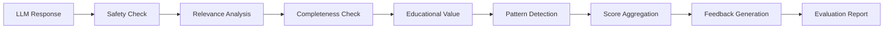

# 🎓 LLM Response Evaluator for Educational Content

[](https://www.python.org/downloads/)
[](https://opensource.org/licenses/MIT)
[](https://github.com/psf/black)

A comprehensive framework for evaluating LLM-generated educational responses, designed specifically for K-12 educational content quality assurance. Built with the needs of educators in mind, this tool helps ensure AI-generated content is safe, accurate, and pedagogically sound.

## 🌟 Key Features

### 📊 Multi-Dimensional Evaluation
- **Relevance Scoring**: Measures how well responses address the original prompt
- **Completeness Analysis**: Verifies coverage of expected topics
- **Safety Assessment**: Screens for age-inappropriate or harmful content
- **Educational Value**: Evaluates pedagogical effectiveness
- **Accuracy Indicators**: Identifies patterns suggesting factual accuracy

### 🎯 Education-Specific Features
- **Grade-Level Appropriateness**: Customizable evaluation for K-5, 6-8, 9-12
- **Curriculum Alignment**: Check responses against expected learning outcomes
- **Readability Analysis**: Ensures content matches student comprehension levels
- **Engagement Metrics**: Identifies elements that promote active learning

### 🔍 Pattern Detection
- Identifies common LLM response patterns and potential issues
- Detects repetitive content, formatting problems, and structural issues
- Tracks response quality trends over time

### 📈 Comprehensive Reporting
- JSON and Markdown export formats
- Batch evaluation capabilities
- Aggregated metrics and pattern analysis
- Actionable feedback generation

## 🚀 Quick Start

### Installation

```bash
# Clone the repository
git clone https://github.com/yourusername/llm-response-evaluator.git
cd llm-response-evaluator

# No external dependencies required! Uses Python standard library only
python3 --version  # Ensure Python 3.8+
```

### Basic Usage

```python
from llm_response_evaluator import EducationalResponseEvaluator

# Initialize evaluator for middle school content
evaluator = EducationalResponseEvaluator(grade_level="6-8")

# Evaluate a response
result = evaluator.evaluate_response(
    prompt="Explain photosynthesis in simple terms",
    response="[LLM response here]",
    expected_topics=["sunlight", "carbon dioxide", "oxygen", "chlorophyll"]
)

# View results
print(f"Quality Score: {result.overall_score}/1.0")
print(f"Quality Level: {result.quality_level.value}")
print(f"Safety Status: {result.safety_level.value}")
```

## 📝 Example Use Cases

### 1. Single Response Evaluation
Evaluate individual LLM responses for quality and safety:

```python
python example_usage.py
# See Example 1: Single Response Evaluation
```

### 2. Comparative Analysis
Compare multiple AI responses to identify the best option:

```python
# Compare responses from different models or prompts
results = evaluator.batch_evaluate(test_cases)
```

### 3. Pattern Analysis
Identify systematic issues across multiple responses:

```python
# Detect common problems like repetition, formatting issues, or safety concerns
patterns = evaluator._detect_patterns(response)
```

### 4. Quality Assurance Workflow
Integrate into your QA pipeline:

```python
# Run comprehensive test suite
python test_cases.py
```

## 🏗️ Architecture

### Core Components

```
llm_response_evaluator.py
├── EducationalResponseEvaluator   # Main evaluation class
│   ├── evaluate_response()        # Single response evaluation
│   ├── batch_evaluate()           # Multiple response evaluation
│   └── export_evaluation_report() # Report generation
│
├── EvaluationResult               # Structured results dataclass
├── QualityLevel                   # Quality classifications
└── SafetyLevel                    # Safety classifications
```

### Evaluation Pipeline



## 📊 Metrics Explained

| Metric | Description | Range |
|--------|-------------|-------|
| **Overall Score** | Weighted average of all metrics | 0.0 - 1.0 |
| **Relevance** | How well response addresses the prompt | 0.0 - 1.0 |
| **Completeness** | Coverage of expected topics | 0.0 - 1.0 |
| **Safety Level** | Content appropriateness | Safe/Review/Unsafe |
| **Educational Value** | Pedagogical effectiveness | 0.0 - 1.0 |
| **Accuracy Indicators** | Patterns suggesting factual accuracy | 0.0 - 1.0 |

## 🧪 Testing

Run the comprehensive test suite:

```bash
python test_cases.py
```

This executes 8 different test scenarios covering:
- ✅ High-quality explanations
- ⚠️ Incomplete responses
- ❌ Off-topic content
- 🚨 Safety concerns
- 📚 Grade-level appropriateness
- 🔄 Pattern detection

## 📁 Project Structure

```
llm-response-evaluator/
│
├── llm_response_evaluator.py  # Core evaluation framework
├── test_cases.py              # Comprehensive test suite
├── example_usage.py           # Usage examples and demonstrations
├── requirements.txt           # Dependencies (optional enhancements)
├── README.md                  # Documentation
│
├── evaluation_report.json     # Sample JSON report output
└── evaluation_report.md       # Sample Markdown report output
```

## 🎯 Alignment with MagicSchool's Mission

This project directly addresses key requirements for LLM quality assurance in educational contexts:

### ✅ Feedback Management
- Systematic intake and triage of quality issues
- Pattern identification across multiple responses
- Actionable feedback generation

### ✅ Ground Truth Development
- Framework for creating and validating ground truth datasets
- Structured evaluation rubrics
- Test case management

### ✅ Educational Focus
- Grade-level appropriate evaluation
- Safety screening for K-12 content
- Pedagogical effectiveness metrics

### ✅ Scalability
- Batch processing capabilities
- No external dependencies for easy deployment
- Extensible architecture for future enhancements

## 🔮 Future Enhancements

- [ ] Integration with popular LLM APIs
- [ ] Real-time evaluation dashboard
- [ ] Machine learning-based accuracy prediction
- [ ] Automated prompt improvement suggestions
- [ ] Multi-language support
- [ ] Curriculum standard alignment (Common Core, NGSS, etc.)

## 🤝 Contributing

Contributions are welcome! Areas of interest:
- Additional evaluation metrics
- Subject-specific rubrics
- Integration with educational platforms
- Performance optimizations

## 📄 License

MIT License - feel free to use this in your own projects!

## 🙏 Acknowledgments

Built with educators in mind, inspired by the need for high-quality AI content in education. Special consideration given to:
- Teacher workflows and needs
- Student safety and age-appropriateness
- Educational best practices
- Accessibility and inclusivity

## 📧 Contact

For questions or collaboration opportunities, feel free to reach out!

---

**Note**: This evaluator is designed to augment human judgment, not replace it. Always have qualified educators review AI-generated content before classroom use.

🎓 **Built for educators, by someone passionate about education technology!**
